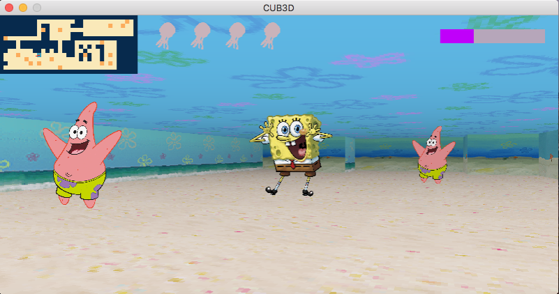

# 42cursus_cub3d
This project is inspired by the world-famous eponymous 90's game, which was the first FPS ever. It will enable you to explore ray-casting. Your goal will be to make a dynamic view inside a maze, in which you'll have to find your way.
<br>
<br>
### commands
git clone repository
```
git clone https://github.com/deftones88/42cursus_cub3d.git
```
compile and run
```
make bonus; ./cub3d map/bonus.cub
```


### movement controls
- W : up
- S : down
- A : left
- D : right (moving the mouse pointer also works for both left/right)
- &#8593; : look up
- &#8595; : look down
- ESC : exit (close button also works)
<br>


<br>
<br>

MARK : 
